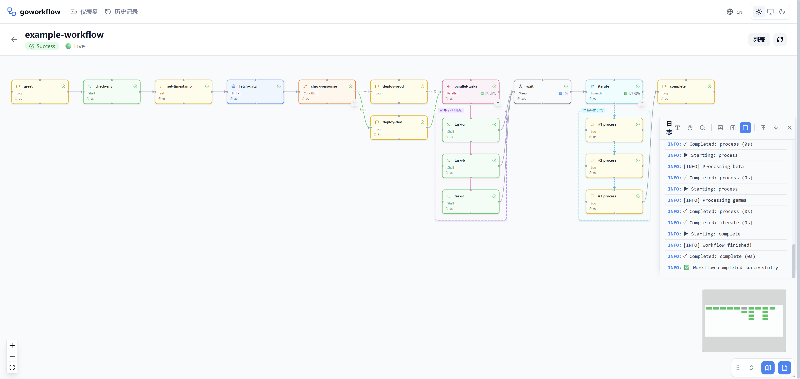
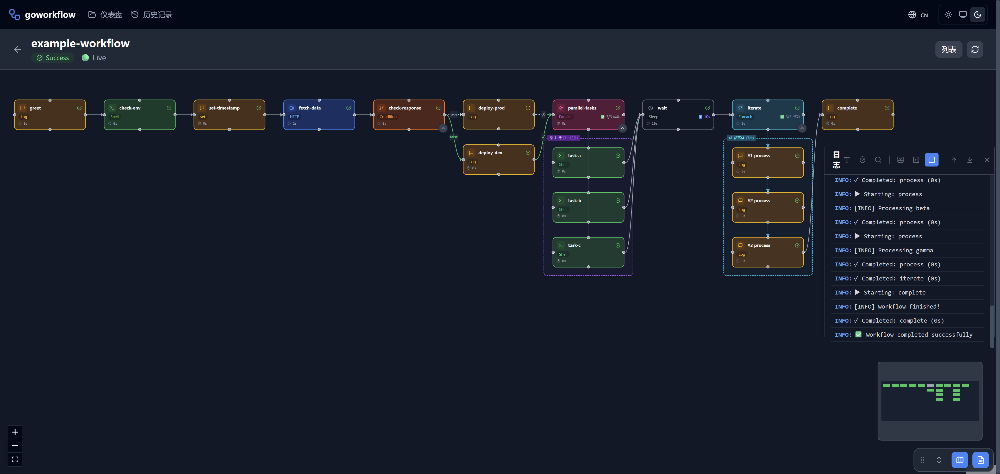

# seneschal

> seneschal（觞政，/ˈsɛnɪʃəl/）—— 文人雅集中掌管流程的总管。

一个 YAML 驱动的工作流引擎。用 YAML 描述工作流,一次定义、反复执行;**没配 AI 时是确定性的可重放引擎,配了 AI 后可在标定步骤里引入智能**。




## 为什么用它

- **YAML 即一切**:变量、条件、分支、循环、并行、HTTP、模板渲染,全部在 YAML 里写完。改行为 = 改 YAML,重新跑。
- **确定优先**:工作流本身是可审、可版控、可重放的蓝图。AI 只在你显式标定的步骤里作为"函数"介入,产出进入变量系统,不破坏其余流程的确定性。
- **AI 可选,渐进增强**:没有 AI 时一切照常;接入 AI 后,可让某一步做摘要、分类、语义判断,甚至用一句话"把 staging 更到最新"自动选工作流并填参执行。
- **多渠道触达**:同一套引擎,本机 CLI / Web UI / IM Bot(飞书等)/ 编程 API 都能触发与查看执行。
- **单二进制部署**:server 内嵌前端,一个 `seneschal-server` 全部搞定。

## 三个产物

| 产物 | 路径 | 用途 |
|---|---|---|
| `seneschal` | `cmd/cli/` | 命令行工具,本机运行/校验/TUI 实时查看工作流 |
| `seneschal-server` | `cmd/server/` | HTTP + WebSocket 服务,内嵌 React 前端,远程运行/编辑/可视化 |
| `workflow` | `workflow/` | 可复用的 Go 库,核心执行引擎(DAG 调度、变量、多种 action) |

## 快速开始

```bash
# 构建全部
./build.sh

# 创建一个工作流
seneschal create my-workflow "My first workflow"

# 运行(详细输出)
seneschal run my-workflow.yaml --verbose

# 校验语法
seneschal validate my-workflow.yaml

# 用 TUI 实时查看
seneschal run my-workflow.yaml --output-mode tui

# 查看示例模板
seneschal template
```

## CLI 命令

| 命令 | 说明 |
|---|---|
| `run <file>` | 执行一个工作流 YAML 文件 |
| `create <name>` | 创建一个新的工作流 YAML 文件 |
| `validate <file>` | 校验工作流语法 |
| `show <file>` | 显示工作流 YAML 内容 |
| `edit <file>` | 在编辑器中打开 YAML |
| `template` | 打印示例工作流 YAML |
| `chat <意图>` | _(Roadmap)_ 自然语言触发:选工作流 + 填变量 + 执行 |
| `generate <需求>` | _(Roadmap)_ 自然语言生成工作流 YAML |

### run 常用 flag

| flag | 说明 |
|---|---|
| `--var key=value` | 覆盖或设置工作流变量 |
| `--verbose` / `-v` | 详细输出 |
| `--dry-run` | 预演,不实际执行 |
| `--output-mode <mode>` | 输出模式:`plain` / `rich` / `compact` / `dag` / `timeline` / `tui` |
| `--theme <name>` | 主题(配合 rich/tui) |
| `--tui-style` | TUI 样式 |

## YAML Schema

```yaml
name: my-workflow          # 必填:工作流名称
version: "1.0"             # 可选:版本字符串
description: "Description" # 可选:人类可读描述

variables:                  # 可选:工作流级变量
  key: value

steps:                      # 必填:步骤列表
  - name: step-name         # 必填:唯一步骤名
    action: shell           # 必填:action 类型
    # ... 各 action 的字段
```

## 支持的 Action

### `shell` - 执行命令
```yaml
- name: build
  action: shell
  command: "go build -o app ."
  dir: "./src"              # 可选:工作目录
  shell: bash               # 可选:sh, bash, cmd, powershell
  env:                      # 可选:步骤级环境变量
    GOOS: linux
  continue_on_error: false  # 可选:失败后是否继续
  output_var: build_result  # 可选:整段输出存入变量
  output_vars:              # 可选:按 KEY=VALUE 行解析存多个变量
    - GO_VERSION
```

### `http` - HTTP 请求
```yaml
- name: api-call
  action: http
  url: "https://api.example.com/data"
  method: POST              # GET, POST, PUT, DELETE
  headers:
    Content-Type: application/json
  body: '{"key": "{{.value}}"}'
  timeout: "30s"
  save_output: response     # 响应(含 status/body/headers)存入变量
```

### `condition` - 条件分支
```yaml
- name: check-env
  action: condition
  expression: "{{.env}} == prod"
  then:
    - name: prod-step
      action: log
      message: "Production!"
  else:
    - name: dev-step
      action: log
      message: "Development!"
```

支持运算符:`==`、`!=`、`contains`、`>`、`<`、`>=`、`<=`(表达式求值由 [expr-lang/expr](https://github.com/expr-lang/expr) 提供)。

### `set` - 设置变量
```yaml
- name: my-var
  action: set
  value: "computed value {{.other_var}}"
```

### `parallel` - 并行执行
```yaml
- name: parallel-jobs
  action: parallel
  steps:
    - name: job-a
      action: shell
      command: "echo A"
    - name: job-b
      action: shell
      command: "echo B"
```

### `foreach` - 循环遍历
```yaml
- name: process-services
  action: foreach
  items:
    - "auth"
    - "api"
    - "worker"
  item_var: service         # 默认: "item"
  do:
    - name: deploy
      action: log
      message: "Deploying {{.service}}"
```

### `sleep` - 等待
```yaml
- name: wait
  action: sleep
  duration: "5s"            # Go duration: 1s, 2m, 1h30m
```

### `log` - 打印消息
```yaml
- name: info-msg
  action: log
  message: "Status: {{.status}}"
  level: info               # info, warn, error
```

### `template` - 渲染模板文件
```yaml
- name: render-config
  action: template
  source: "config.template" # 含 {{.var}} 语法的模板文件
  output: "config.yaml"     # 输出文件路径
```

### `ai` / `ai_decide` - AI 介入 _(Roadmap)_

> 这是 seneschal 区别于其他 YAML 工作流工具的核心差异化能力,详见 [docs/PRODUCT.md](docs/PRODUCT.md)。

```yaml
# ai:让 AI 生成一段文本(摘要、翻译、分类…)
- name: summarize
  action: ai
  prompt: "用一句话总结这段日志:{{.log_text}}"
  save_output: summary

# ai_decide:让 AI 做语义判断,返回 true/false
- name: is_urgent
  action: ai_decide
  question: "这封邮件是否需要紧急处理?{{.email_body}}"
  save_output: is_urgent   # 自动转 bool
```

**支持 Anthropic 协议(Claude 原生、DeepSeek `api.deepseek.com/anthropic` 等)与 OpenAI 兼容协议**。API key 只从环境变量读取,绝不写进 YAML。详见 [docs/PRODUCT.md](docs/PRODUCT.md) 的"Provider 架构"。

## DAG 模式

默认步骤按顺序执行;显式声明依赖即按 DAG 并发调度:

```yaml
mode: dag
steps:
  - name: build
    action: shell
    command: go build
    next: [test, lint]      # build 完成后,test 和 lint 并发
  - name: test
    action: shell
    command: go test ./...
    depends_on: [build]
  - name: lint
    action: shell
    command: golangci-lint run
    depends_on: [build]
```

## Go 库用法

```go
package main

import (
    "fmt"
    "github.com/whitefirer/seneschal/workflow"
)

func main() {
    wf, err := workflow.ParseFile("my-workflow.yaml")
    if err != nil {
        panic(err)
    }

    executor := workflow.NewExecutor(map[string]string{
        "ENV": "production",
    })
    executor.SetVerbose(true)
    result := executor.Execute(wf)
    fmt.Printf("Status: %s\n", result.Status)
}
```

## 编辑 YAML → 改变行为

核心理念:**编辑 YAML,重跑,行为改变**。

```bash
seneschal show deploy.yaml     # 查看当前
# (在任意编辑器里改:把 env 从 dev 改成 prod、加步骤…)
seneschal run deploy.yaml --verbose --var ENV=prod
```

## 构建

```bash
./build.sh                    # 前端 + server + cli 一起构建
# 或手动:
cd web/frontend && npm run build && cd ../..
go build -o seneschal-server ./cmd/server/
go build -o seneschal ./cmd/cli/
```

## 服务端运行

```bash
./start-server.sh
# 或:./seneschal-server --port 8888
```

⚠️ **安全告示**:`seneschal-server` 默认只监听 `127.0.0.1`,**不要直接暴露到公网**。`shell` action 会以服务进程身份执行任意命令,且其中的 `{{.变量}}` 经模板渲染后直接进入 `sh -c` —— 不可信输入(API 请求体、webhook 参数、LLM 生成的参数)可注入命令。绑定非 localhost 地址时务必在 `server.yaml` 配置 `auth_token`(见 [config.example.yaml](config.example.yaml)),或放在加鉴权、TLS、限流的反向代理之后。详见 [ARCHITECTURE.md](ARCHITECTURE.md) 的"安全"章节。

## 进一步阅读

- [docs/PRODUCT.md](docs/PRODUCT.md) — 产品定位、AI 介入的 6 种模式、确定性模型、Provider 与渠道架构
- [ARCHITECTURE.md](ARCHITECTURE.md) — 技术架构、执行管线、内核数据结构
- [docs/ROADMAP.md](docs/ROADMAP.md) — 实施路线(Phase 0 - Phase 9)

## License

MIT
